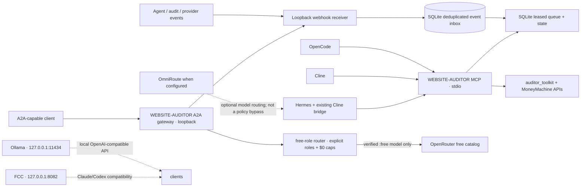

# Local integrations

The integration layer gives Hermes, Cline, OpenCode, and other MCP-capable clients one shared, bounded interface to WEBSITE-AUDITOR. The existing SQLite database, leased pipeline, supervisor, approval records, and policy remain authoritative. Obsidian is a read-mostly operator view.



No Goose integration is part of this architecture. Existing historical files are left untouched. There are no pairwise agent adapters beyond the already established Hermes→Cline bridge.

## Start and inspect

From the repository root:

```sh
./mm integrations
./mm integrations --json
./mm mcp-server
./mm webhook-server
./mm a2a-gateway
```

MCP uses stdio and starts on demand from each client. Do not run the stdio command in a terminal intended for normal operator output. Webhooks listen at `http://127.0.0.1:8093` by default; `GET /health` is the local liveness endpoint. Routes are `POST /webhooks/github`, `/webhooks/agent`, `/webhooks/audit`, `/webhooks/provider`, and `/events`. Payload size is capped at 256 KB. The receiver rejects non-loopback binds.

| Service | Default endpoint | Use |
| --- | --- | --- |
| FCC | `http://127.0.0.1:8082` | Claude/Codex compatibility proxy; not the orchestrator |
| Ollama | `http://127.0.0.1:11434` | Direct local OpenAI-compatible endpoint |
| Webhook receiver | `http://127.0.0.1:8093` | Local event intake |
| WEBSITE-AUDITOR MCP | stdio | Shared first-party safe tool surface |
| WEBSITE-AUDITOR A2A gateway | `http://127.0.0.1:8094/a2a` | Repo-owned, loopback-only A2A role gateway; never routes model work through OmniRoute |
| OmniRoute | `http://127.0.0.1:20128` (discovered local config; override with `OMNIROUTE_BASE_URL`) | Primary router; MCP/A2A status is queried from installed CLI |

`./mm integrations` performs lightweight local process/socket probes only. An installed CLI or configured MCP executable is not proof that it authenticates or successfully serves MCP. GitHub operations should use GitHub MCP; the webhook receiver only accepts signed events.

## Client configuration

Copy and adapt `.mcp.json.example`, `.cline/mcp.json.example`, or `opencode.json.example` according to the installed client version. GitHub uses GitHub's [official `github/github-mcp-server`](https://github.com/github/github-mcp-server), pinned here to `v1.12.2`. On this Mac, install its local binary with `GOBIN=/Users/dd/.local/bin go install github.com/github/github-mcp-server/cmd/github-mcp-server@v1.12.2`; ensure `/Users/dd/.local/bin` is on the MCP client's PATH. The examples run `stdio` in `--read-only` mode and restrict toolsets. Put a least-privilege `GITHUB_PERSONAL_ACCESS_TOKEN` in the MCP client's environment/secret store. Do not put a real token in a checked-in file. GitHub's hosted MCP server supports OAuth in compatible MCP clients; the local server examples use a token.

The selected Obsidian vault is ID `b5d58a08e16fab4e`, path `/Users/dd/Downloads/CatalyxLabs_Master_Brain_V7`. It is the V7 Obsidian-ready export and contains the WEBSITE-AUDITOR plan. Keep runtime authority in Git/SQLite. Vault as MCP v1.2.0 is enabled in that vault, auto-starts, and is bound to localhost on port `8765`; its endpoint is `http://127.0.0.1:8765/mcp`. A local MCP `initialize` request returned HTTP 200 (protocol `2025-06-18`) after reopening the vault, and the Claude stdio bridge successfully returned `tools/list`; no vault tools were invoked. The active ACL forbids `private/**` and `secrets.md`, keeps `archive/**` and `templates/**` read-only, and sets `AI-Review/**` as the only writable path. The empty `AI-Review/` folder was created. Keep remote CORS access disabled. The existing `.hermes/plugins/cline-bridge` project plugin remains in place.

For Hermes, add `./mm mcp-server` and the GitHub stdio server using Hermes's installed MCP configuration mechanism. Add Obsidian's Streamable HTTP endpoint after enabling the plugin. Preserve the current Cline bridge plugin. Hermes configuration formats vary by installed release, so no user-level configuration is overwritten by this repository change.

After copying a template, supply GitHub's token through the active client's secret store, enable Obsidian's MCP entry after plugin setup, restart the client, and verify each through its MCP status/log view. `./mm integrations` checks local command/port availability; it does not authenticate GitHub or claim an MCP handshake succeeded.

## Event envelope and security

Every stored event uses this exact envelope (`schema_version` is currently `1`):

```json
{
  "event_id": "unique-event-id",
  "type": "audit.completed",
  "source": "auditor",
  "created_at": "2026-09-24T00:00:00+00:00",
  "correlation_id": "job-or-trace-id",
  "payload": {},
  "schema_version": 1
}
```

Supported types: `prospect.discovered`, `prospect.qualified`, `audit.requested`, `audit.started`, `audit.completed`, `audit.failed`, `evidence.ready`, `proof.ready`, `quote.ready`, `draft.ready`, `review.required`, `job.started`, `job.completed`, `job.failed`, `provider.rate_limited`, `provider.recovered`, `agent.started`, `agent.completed`, `agent.failed`, `github.pr_opened`, `github.ci_failed`, and `github.ci_passed`.

GitHub requests require `X-Hub-Signature-256` verified with `GITHUB_WEBHOOK_SECRET`. Agent requests require `Authorization: Bearer …` matching `MM_AGENT_WEBHOOK_TOKEN`. Audit/provider generic routes accept local requests; keep the listener loopback-only. Set secrets in the process environment or OS keychain. Never log request headers or payloads. Duplicate `event_id` values are ignored by a SQLite primary key.

`integrations.schemas.EventEnvelope` and `JobHandoff` provide strict, dependency-free Python schemas. Job constraints must retain `paid_allowed=false` and `max_cost_usd=0`; send, deploy, and purchase flags cannot be enabled by a job document and still require their existing human approval routes.

## MCP safe surface

Tools expose status/health, public prospect lookup/search, evidence reads, deterministic score reads, bounded queue submission/retry, quote/draft/proof status, approval gates, metrics/errors/DLQ, and Obsidian sync. Every prospect lookup excludes dummy/test records. `audit_site` enqueues through the existing leased queue; a worker/supervisor performs the existing work. Quote and draft tools return stored artifacts and do not generate/send outreach. Proof tools report existing evidence and never deploy or modify the live site. No shell, credential, send, push, deploy, purchase, or unrestricted delete tool exists.

## Routing and cost controls

WEBSITE-AUDITOR's A2A gateway is a separate, repo-owned service. It accepts only explicit role names from `money-machine/config/routing.yaml`; prompts must be labeled `public` or `synthetic`, are redacted, and secret-like prompts are rejected. Every task must supply an idempotency key; the existing SQLite state stores only its hash, role, status, and model, never the prompt or answer. A repeated key is rejected rather than re-running a provider call. It routes only through `money-machine/scripts/free_role_router.py`, which verifies the live catalog, requires `:free` models and zero prices, sends zero price caps with `require_parameters`, denies data collection, and stops on quota/billing errors. Unknown roles, unknown/changed prices, unknown reported cost, unknown model responses, disabled policy, and unavailable catalogs fail closed. It exposes only `tasks.create`, `tasks.get`, an Agent Card, and health; it does not expose OmniRoute's provider-routing tools or A2A skills.

The gateway is off by default. To run it, first provide a strong `MM_A2A_GATEWAY_TOKEN` through a local secret store/process environment, then explicitly set `MM_A2A_GATEWAY_ENABLED=1`, `MM_A2A_FREE_ROUTING=1`, and `MM_ALLOW_EXTERNAL_FREE_MODELS=1` in that process. Bind remains loopback-only at `127.0.0.1:8094`; POSTs require the bearer token. External model calls are therefore doubly opt-in and limited to the checked free-role policy. No model task was sent during implementation or testing. `./mm integrations` reports gateway health separately from OmniRoute's native A2A status. OmniRoute's own A2A remains outside this repo's enforcement boundary and must stay disabled if all A2A-triggered model work is required to obey WEBSITE-AUDITOR's free-role router.

The free-role router now reads its canonical in-repo policy at `money-machine/config/routing.yaml`; it does not depend on a machine-only `control-plane/config` file. FCC remains at port 8082 for compatibility; Ollama stays directly available at port 11434. The existing local/free role router and fail-closed `DEFER` behavior remain authoritative. Paid routes remain disabled (`paid_allowed=false`, `max_cost_usd=0`); the gateway cannot approve outreach, pricing, deployment, or sends.

## Troubleshooting and limitations

- `./mm integrations --json`: inspect each probe and `last_error` without secrets.
- MCP client cannot launch: confirm `./mm` selects an installed Python 3.11+ `.venv-email`, or set `MM_PYTHON` to a verified interpreter; inspect client logs for stdio startup errors.
- Webhook `401`: check the relevant secret is set in the receiver process environment and confirm exact raw-body GitHub signature handling.
- Webhook `400`: check event type, timezone-aware timestamp, envelope field names, and schema version.
- Duplicate event returns `200`: that event ID is already stored and was not applied twice.
- FCC/Ollama unavailable: check their loopback service directly; integration status does not start them.
- GitHub's official MCP binary is built locally at v1.12.2; Claude Desktop also has the remote GitHub MCP configured with `repos,issues,pull_requests,actions` and read-only enforced, but OAuth authorization remains pending. The selected Obsidian vault's plugin is live on loopback and its Claude stdio bridge completed initialization and tool discovery. OmniRoute is running at the discovered loopback URL, while its MCP and A2A services are disabled. No GitHub connection is claimed authenticated until OAuth is completed.

Runtime job/event history remains in SQLite. Obsidian mirrors operator summaries only and cannot authorize actions. Network audit fetches, if executed by the pre-existing workers, remain subject to their current network/politeness controls.
