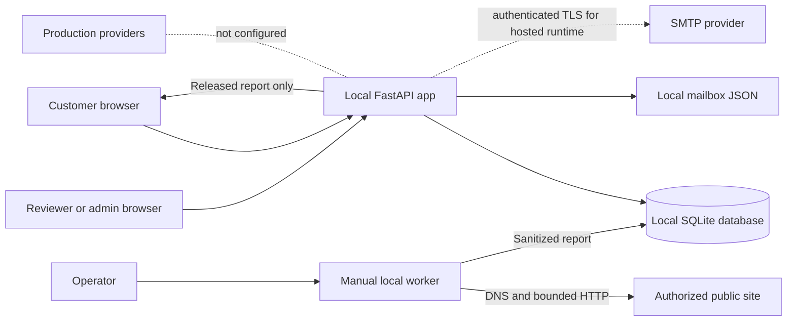

# CatalyxLabs Website Auditor data map

- **Status:** Source-derived draft for owner and privacy review; not approved
  for customer-data use.
- **Reviewed:** 2026-09-28 against current worktree
- **Implementation base:** `eb9f262e231934a5c47b009c411c8e173edbd00c` plus the
  uncommitted source changes recorded in `release-readiness.md`

## Scope and confidence

This map describes the current local `catalyx_web` source and its staging files.
The application uses a separate SQLite database by default. A PostgreSQL
adapter exists, but has not been tested against a live server. No production
provider, data region, backup system, object store, queue service, identity
provider, or external email processor is selected. The local manual audit
worker can make a bounded request to an authorized public site only when an
operator explicitly runs it; the customer-facing service does not start scans.

“Current handling” below is source-observed. Any location, retention, deletion,
backup, or access behavior marked **unselected** requires an owner/privacy
decision and implementation evidence before real customer data is accepted.

## Current local data flow

The browser and worker paths above describe the local implementation. The
manual worker is opt-in and not an isolated production service. Hosted mail
defaults to disabled. SMTP requires explicit SMTP mode and
`CATALYX_EXTERNAL_SEND_ALLOWED=true`; no provider or credentials are selected,
and this is not a planned data transfer approval.

## Application database records

| Record | Stored fields and purpose | Access in the local app | Current lifecycle and open decisions |
|---|---|---|---|
| `users` | Internal ID; email; password hash; email-verification time; disabled time; creation time. Supports sign-in, verification, account administration, and audit attribution. | Sign-in and account flows; customer views use the signed-in user; owner/admin customer screens; reviewer queue shows requester email. Passwords are stored as PBKDF2 hashes. | No approved account-retention or deletion rule. Disabling an account revokes its sessions, but does not delete its records. |
| `workspaces` | Internal ID; display name; creation time. Tenant boundary for sites, requests, and privacy records. | Customer queries filter by workspace. Platform review and owner/admin screens have broader operational access. | No workspace closure or deletion implementation or retention period. Agency/multi-client behavior is undecided. |
| `memberships` | Workspace/user IDs; role; active flag; encrypted TOTP seed for privileged accounts; creation time. Enforces roles and admin MFA. | Server-side role checks. Customer, support, reviewer, admin, and owner capabilities differ. | TOTP seeds use a versioned authenticated ciphertext. Local SQLite key is in an adjacent owner-only sidecar; PostgreSQL requires an environment key. Production secret storage, rotation, recovery, and seed removal on role/account closure are not designed. |
| `sites` | Internal ID; workspace ID; normalized origin and host; customer label; creator ID; creation and soft-delete times. Stores only the site origin, not submitted paths, query strings, or fragments. | Owning workspace; authorized reviewer/administrator screens as needed for request review. | A `deleted_at` field exists; no customer deletion flow or retention policy is approved. Decide treatment of site origins in reports, logs, and backups. |
| `authorization_receipts` | Internal ID; workspace/site/user IDs; authorization statement; statement version; timestamp. Records permission asserted for a request. | Customer can see request history; authorized admin/reviewer can inspect a receipt while reviewing. | No retention or legal-evidence period is approved. Define whether a receipt survives site/account deletion and how backups expire. |
| `audit_requests` | Internal ID; workspace/site/requester/authorization IDs; fixed profile; state; idempotency key; created/updated times; reviewer and reason; attempt count; worker lease time and fencing token. Tracks request, retry eligibility, lease ownership, and review operations. | Owning customer can see their request; reviewer/admin roles can inspect queue state, attempt counts, and outcome reasons. | The customer web worker is disabled. Local failures remain in this table and eligible retries require a reviewer reason. There is no production dead-letter service or provider-outage recovery flow. Decide how long identifiers, lease metadata, and operator reasons remain. |
| `sessions` | SHA-256 session-token hash; user/workspace IDs; CSRF token; expiry and creation times. Supports authenticated sessions. | Read by the server for the presented cookie; no customer API returns session rows. CSRF values are stored in the database. | Expired rows are cleaned on successful sign-in. Password reset and account disable revoke sessions. Set session duration, database protection, and backup expiry for production. |
| `auth_rate_limits` | Scope; SHA-256 subject hash; window start; attempt count; update time. Supports persistent sign-in, registration, and reset throttles without storing the raw subject in this table. | Server-only. | Local sign-in uses an IP bucket (8 attempts/minute) and an email-keyed failed-attempt bucket (12/hour). Only failed credentials consume the email bucket; a valid sign-in bypasses and clears it, so unauthenticated attempts cannot block a customer with valid credentials. Old rows are pruned periodically during limiter use. Production client-IP/proxy semantics, thresholds, and row-count bounds remain unresolved and need owner-approved abuse controls. |
| `verification_tokens` | SHA-256 token hash; user ID; expiry and creation times. Supports one-time email verification. | Server-only; the bearer link is delivered through the local staging mailbox. | Expired rows are removed during registration and used tokens are deleted. Define production delivery, expiry, and backup treatment. |
| `password_reset_tokens` | SHA-256 token hash; user ID; expiry and creation times. Supports one-time password recovery. | Server-only; the bearer link is delivered through the local staging mailbox. | Expired/previous tokens are removed when a reset is requested; successful reset deletes tokens and revokes sessions. Define production delivery, expiry, and backup treatment. |
| `admin_activity` | Actor ID and role; action; target type and ID; reason; JSON metadata; creation time. Records high-impact review/support actions and customer completion of an approved export. | Owner/admin activity screen; write access through guarded server operations, including the authenticated customer export completion event. | Local DB administrators can alter records directly. No tamper-resistant production store, retention period, export, or alerting rule is selected. |
| `privacy_requests` | Internal ID; workspace/user IDs; request type (`access`, `export`, `delete`); state; customer note; admin reason; created/updated times; reviewer ID. Tracks rights requests. | Customer sees their own request; owner/admin roles review details. | After a reason-recorded identity review, an owner/admin can approve access/export. The signed-in requester downloads a minimized JSON export scoped to their account, with only reports already released to them; the download is logged, the request closes, and no separate export file is retained. Deletion is still not executed. Owner/privacy approval of identity checks, deadlines, retention, backup expiry, and export field scope remains required. |
| `audit_results` | Audit ID; workspace ID; report schema/profile; JSON report; report hash; creation time. Holds sanitized single-page audit findings and check results. | Reviewer/admin during quality review; owning customer only after release. | No private object store is configured; results remain in the application database. Set evidence minimization, retention, encryption, backup, and deletion rules. |
| `report_releases` | Audit ID; reviewer ID; release/withhold state; reason; report hash; creation time. Controls and records report publication. | Reviewer/admin writes; owning customer can observe released report through its request view. | No expiry or release-reversal lifecycle is defined. Decide whether release decisions and hashes persist after report deletion. |
| `catalyx_schema_version` (PostgreSQL adapter) | Singleton schema version. Migration bookkeeping only. | Database migration/runtime. | Contains no intended customer content; operational backups follow the still-unselected database backup policy. |

## Files, secrets, and derived artifacts

| Artifact | Current contents and location | Protection and exposure | Retention and release decision |
|---|---|---|---|
| SQLite database | Default `state/catalyx-app.sqlite3`, or the path selected by `CATALYX_DB_PATH`; contains the records above. | Startup rejects a final-path symlink, requires an owner-owned regular file, sets mode `0600`, and verifies that group/other access is removed. Failure blocks startup. This is file permission protection, not database encryption at rest. | No approved backup or retention process. Choose encryption, backup, restore, region, and deletion behavior before customer data. |
| Local TOTP key sidecar | `<database filename>.totp-key`, containing base64url-encoded 256-bit key material. | Created with mode `0600`; owner-only regular-file checks; excluded from Git. Loss prevents seed decryption; exposure compromises stored MFA seeds. | Keep paired with local DB backups only for local recovery. Production must use an approved secret manager and define rotation and lost-key recovery. |
| Local mailbox | `state/catalyx-local-mailbox.json` by default or `CATALYX_LOCAL_MAILBOX`; contains verification and password-reset bearer URLs plus token expiry. | Written with mode `0600`; explicit CLI command can print its contents. Do not copy links into chat, logs, or shared storage. Local staging defaults to this mode; SMTP is a separately configured alternative. | Local entries are removed on startup after token expiry, when a token is consumed, and when new messages are added; at most 50 are retained. This bounds local mailbox exposure but does not set a production email or log-retention policy. |
| Browser cookies and responses | Session bearer token in an HTTP-only, same-site cookie; pre-auth CSRF cookie; signed-in page/API responses include account-specific data. | Session token is hashed in the DB; production cookies are marked secure. Local requests and browser profiles still need staging controls. | Cookie max-age follows the source constant; no provider/CDN caching review has been performed. Set production origins, cache policy, and session expiry. |
| Application/server logs | Source logs local mail-save success/failure and admin-account creation email. The CLI prints a one-time TOTP setup secret/provisioning URI when creating an admin. | Do not retain stdout/stderr or provider request logs without confirming redaction. The CLI output is sensitive setup material. | No production logging provider, access list, retention period, redaction test, or alert owner is approved. |
| Manual audit network requests | When explicitly invoked, the local harness fetches one authorized public page plus robots policy and follows only bounded, revalidated redirects. | Connection-time public-address checks and pinned connections are implemented; this is not an independent egress boundary. No model call, email, or customer scan is started by the public app. | No production worker exists. Define request evidence retention, egress allow/deny rules, network logging, and operator access before deployment. |
| Build/dependency artifacts | `uv.lock` and hash-pinned `requirements-catalyx-web.lock`. | Source-controlled dependency metadata; not customer data or secret material. | Keep artifacts tied to a reviewed commit. Dependency/SBOM and provenance approval remains open. |

## Transfers and providers observed

- Local staging stores application records in local SQLite and local verification
  messages in a file by default. The SMTP sender can deliver only account
  verification or password-reset links when explicitly configured; no provider
  or credentials are selected in this worktree.
- No hosted provider configuration or deployment is verified. The source can
  start in hosted mode only after its PostgreSQL, fixed-origin, and TOTP-key
  settings pass validation. SMTP settings are required only after explicit
  send opt-in; validation does not prove provider
  connectivity, migration, or deliverability. No customer data has been routed
  to Vercel, Cloudflare, a remote database/object store/queue, model provider,
  or analytics service by the current local staging setup.
- A future manual worker makes outbound requests to an authorized target site
  and resolves that host to validate and pin public addresses. The deployment
  network policy is not independently enforced or verified.
- The current live `.com`/`.shop` public sites are separate from this local app.
  Their current route probes do not establish data processing by the Auditor.

## Decisions required before real customer data

The owner and privacy/legal reviewer must select and approve:

1. Provider, database, region, identity, queue, report storage, secret delivery,
   and all subprocessors, with a field-to-provider data flow.
2. Purpose, lawful/consent basis, access roles, retention period, and deletion
   rules for every database record and each report/evidence category.
3. Backup contents, encryption, access, expiry, restore objectives, and deletion
   behavior in backups and operational logs.
4. Export format, identity-verification procedure, response owner, and the
   implementation that completes approved access/export/deletion requests.
5. Session, MFA, verification/reset token, mailbox, admin activity, rate-limit,
   web server log, and worker network log retention.
6. Production TOTP-key delivery, rotation, emergency recovery, and the result
   of losing or rotating a key while stored seeds exist.
7. Whether the local browser/API data model, logging, and report evidence are
   sufficient for the approved first-release purpose and audience.

**Release status:** This draft improves Phase B discovery but is not a signed
data map or privacy approval. Keep real customer data and production cutover
gated until the decisions above are approved and implemented evidence is
recorded in a staging release record.
